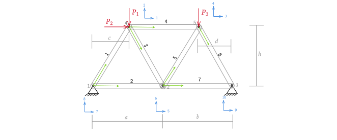

## Getting started

Make sure you have the following tools installed:
- A text editor (VScode, Vim, Emacs, Sublime, Brackets, Notepad++)
- A terminal for running commands
- Node.js
- Git

### Starting from scratch

After creating a folder that will contain the "project". Run the following sequence of commands
- Initialize a git repo: `git init`
- Setup your email and name in git if you haven't:  
`git config user.email "you@example.com"`  
`git config user.name "Your Name"`
- Create a .gitignore file with the following content: 'node_modules'
- Initialize a node package (project): `npm init -y`
- Install all the needed packages for this project: `npm install express nodemon ml-matrix cors`
- Stage all files: `git add .`
- Commit the initial setup of the project: `git commit -m 'Initial files'`

### Starting from the source code

After cloning the repository locally in your machine. Run the following commands:
- Install all the packages: `npm install`
- Run the package: `npm start`
## Input data

## Formulas used
$$ [U_{N}] = [K_{NN}]^{-1} [F_N] $$
$$ [F_{A}] = [K_{AN}] [U_N] $$
$$ [\hat{F_e}] = [T]^{T} [K_{e(g)}] [U_{e(g)}]$$